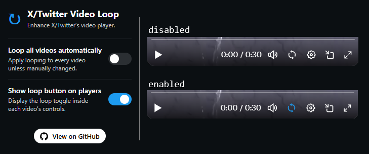

# Twitter Video Loop

`Twitter Video Loop` is a small Chromium extension that adds an option to loop videos in the X/Twitter video player.

## Features

- Adds a loop button directly in the X/Twitter video controls, next to the existing player icons.
- Lets you decide if videos should loop by default, via a simple popup toggle.
- Lets you hide the loop button entirely if you prefer a cleaner player.
- Remembers per-video overrides: if global looping is on but you disable it on a clip, that choice sticks for that video instance.

Works only on `x.com`.